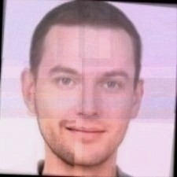

# SecureSquared Face Recognition Challenge Solution

This repository contains a possible solution to the SecureSquared CTF Face Recognition Challenge.

## Analyzing the Authentication System

Before attempting to generate a bypass image for the facial recognition authentication system, it's important to understand how the system works by analyzing its network traffic and code implementation.

### Inspecting Network Activity

When you attempt to authenticate using an image, you should open the Developer Tools in your browser. Navigate to the Network tab to monitor the requests being made.

Upon submitting an image for authentication, you'll notice a request to `signin.json` appearing in the Network tab. This file contains the facial embeddings that are being used for comparison during the authentication process.

### Examining the Source Code

To understand how these embeddings are processed, check the Sources tab in Developer Tools. You'll find that the application is using face-api.js, a JavaScript API for face recognition.

Looking deeper into the implementation, you can see that:

1. The system detects faces in the uploaded image using a Single Shot Multibox Detector (SSD) based on MobileNetV1
2. It then extracts facial landmarks (68 points) to align the face properly
3. A face descriptor (embedding) is generated for the detected face
4. The system compares this descriptor with reference descriptors using Euclidean distance
5. Authentication succeeds when the Euclidean distance is below a certain threshold (0.6 in this case)

With this knowledge of how the system calculates similarity scores using Euclidean distance and the availability of the face descriptors through network monitoring, you have all the necessary components to develop an optimization-based method to bypass the authentication system.

## Overview

The challenge involves bypassing a facial recognition authentication system without having physical access to an authorized user. My approach uses a genetic algorithm to evolve a set of seed images until a face that produces embeddings similar enough to the target to pass authentication is generated.

## How It Works

The solution employs a genetic algorithm that:

1. Starts with multiple seed images as the initial population
2. Evolves these images through selection, crossover, and mutation
3. Evaluates each generation based on similarity to the target embedding
4. Continues evolution until finding an image with sufficient similarity (>0.6)

## Getting Started

### Installation

1. Install dependencies:

   ```bash
   bun i
   ```

2. Start the development server:

   ```bash
   bun dev
   ```

3. Open [http://localhost:3000](http://localhost:3000) in your browser to see the application.

## Usage

0. Upload the target embeddings into the root directory as "target.json"
1. Prepare a diverse set of seed images (around 15 is sufficient)

   - Include a variety of faces of different races and ages
   - Include faces with neutral expressions without glasses or facial hair

2. Upload your seed images using the "Upload Seed Images" button

3. Configure the genetic algorithm parameters:

   - Population Size: ~20
   - Mutation Rate: ~0.8 (higher mutation rate is better)
   - Max Generations: ~300 (may take more iterations)

4. Click "Start Genetic Algorithm" to begin the evolution process

5. Monitor the progress in the "Process" tab

   - The algorithm will display the current generation
   - Best similarity score achieved so far
   - Current best image

6. Once a face with similarity >0.6 is found, it will be displayed in the "Results" tab

7. Save the generated image using the "Save Generated Image" button

## Finding A Bypass Image

1. Do an initial startup with many different races and ages.
2. You may discover that middle-aged white men have a higher similarity compared to other faces. This signifies that the target face is probably a middle-aged white man.
3. Change your seeded images to mostly consist of middle-aged white men and run the algorithm again.
4. Wait until a face with similarity >0.6 is found, and then save the image to use in the signin page of the SecuredSquared website.
5. Get the flag!

## Successful Bypass Image

Below is an image that successfully bypassed the authentication system:



Below is the original image used to create the target embeddings:


