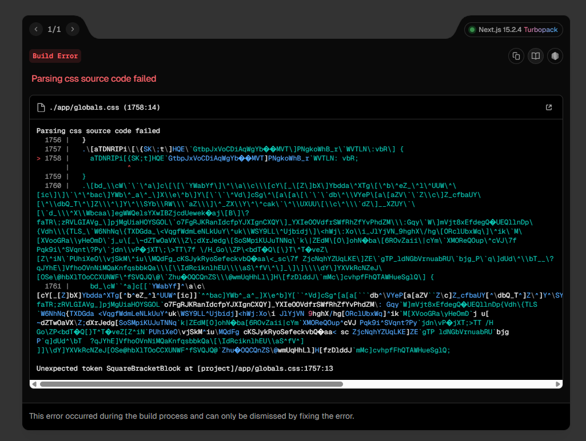

# SecureSquared

This repository contains the web app for the Voice Authentication challenge. Visit the app [here](https://ctf-secure-home.vercel.app).

## Getting Started

### Installation

1. Install dependencies:

   ```bash
   bun i
   ```

2. Run the development server:

   ```bash
   bun dev
   ```

3. Open [http://localhost:3000](http://localhost:3000) in your browser to see the application.

## Note

You might be wondering, why is there a separate web app for the voice authentication challenge when it could have been hosted on the other web app? Great question! It's because a nasty bug started appearing that broke the entire website whenever I tried developing the new page.



Fun thing I discovered while debugging was that the bug disappeared when I disabled turbopack. But if I did that, another bug appeared where all the styling of the website disappeared and it looked like a raw HTML page. Bugs like these are what make me consider dropping Next.js as a framework.
